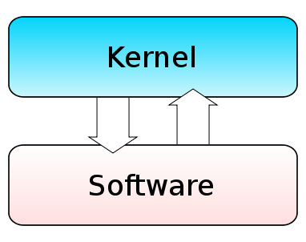
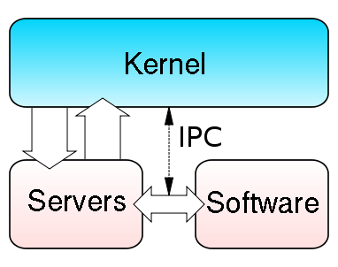
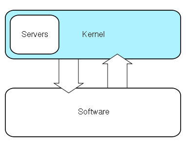

= Operační systémy -- účel, rozdělení a typy jader
:source-highlighter: coderay
:listing-caption: Listing
:icons: font

(C) Lukáš Kotek, https://creativecommons.org/licenses/by-sa/4.0/[CC-BY-SA 4.0]

<<<

== Co je to operační systém?
=== Definice

[quote, 'http://home.zcu.cz/~sberanov/[Zdroj: zcu.cz]']
____
"Operační systém je v informatice základní programové vybavení počítače (tj. software), které je zavedeno do paměti počítače při jeho startu a zůstává v činnosti až do jeho vypnutí. Skládá se z jádra (kernel) a pomocných systémových nástrojů. Hlavním úkolem operačního systému je zajistit uživateli možnost ovládat počítač, vytvořit pro procesy stabilní aplikační rozhraní (API) a přidělovat jim systémové zdroje."
____

[quote, 'https://wikisofia.cz/wiki/Opera%C4%8Dn%C3%AD_syst%C3%A9m#cite_note-nkpOS-3[Zdroj: wikisofia.cz]']
____
"Základní obslužný a řídící program počítače zajišťující mj. komunikaci jeho hardwarové a softwarové složky. Operační systém převádí příkazy zadané uživatelem ve vyšších programovacích jazycích na instrukce srozumitelné procesoru a slouží ke správě počítače a uživatelských aplikací. Mezi operační systémy patří např. MS-DOS, Windows, Unix a Linux."
____

=== Funkce operačního systému

* Organizuje a řídí *přístup k hardwarovým prostředkům*
** Abstrakce hardwarových prostředků 
+
NOTE: Jeden příklad za všechny: Aplikace, chce-li tisknout, nepřistupuje přímo k tiskárně, ale požádá operační systém o přítup -- ten, protože k tiskárně má ovladač, je schopen požadavku vyhovět.
+

** Přístup k adresářům a jednotlivým souborům

* Organizuje a *řídí jednotlivé zpracovávané procesy*
** Přidělování paměti, procesorového času, určování priorit vykonávání procesů
+
TIP: Komponenta, která je součástí jádra OS a jež je za to zodpovědná, se nazývá *"plánovač"*.
+

* Komunikace s uživatelem (ovládání)
** *GUI* (**G**raphical **U**ser Interface) × *CLI* (**C**ommand **L**ine **I**nterface)

== Rozdělení operačních systémů
=== Jednouživatelský × víceuživatelský

Určuje schopnost operačního systému zohledit při výkonu své funkce, který konkrétní uživatel systém používá.

NOTE: Klasickým případem je zohlednění uživatele při přístupu k datům na diskovém oddílu. Pokud ne každý má přístup ke všem umístěním, je pravděpodobné, že se jedná o víceuživatelský operační systém. Pokud dovoluje různým uživatelům vykonávat různé operace, opět to svědčí o jeho víceuživatelském pojetí.

=== Jednoúlohové × víceúlohové

Stanovuje, zda operační *systém může v jeden okamžik vykonávat více úloh*. Bavíme se o tzv. "multitaskingu".

WARNING: Jak je to řešeno u jednojádrových procesorů? 

=== Síťové × nesíťové

Operační systémy, které poskytují (nebo naopak) nějaké *služby v rámci počítačové sítě*.

TIP: Služba v rámci počítačové sítě může poskytovat např. síťové přihlašování a cestovní profily, funkce DNS serveru, přidělování IP adres pomocí DHCP nebo i sdílení souborů.

=== Operační systémy pracující v reálném čase

Operační systémy, jejichž odezva při vykonání úkonů je minimální a jasně předem definovaná.

TIP: Využití u řízení technologický operací v průmyslu, družic, chytrých aut a obecně tam, kde je *nezbytné přesné časování*.

WARNING: Jaká jsou další možná členění? Příklady konkrétních operačních systémů?

== Složení operačního systému
=== Jádro

Nebo také "kernel". Jedná se o základní část operačního systému, řeší práci s hardwarem, *přidělováním hardwarových zdrojů* (procesorový čas, paměť, síťování, přístup k souborovým systémům apod.).

NOTE: Jádra se týká i už zmíněný plánovač. Stejně tak jádro (v závislosti typu) řeší ovladače hardwaru.

image::docker\.png[caption="Obrázek 1: ", title="Docker, autor: Pavouk, licence: CC-BY-SA", link="https://cs.wikipedia.org/wiki/Soubor:Kernel_Layout_cs.svg"]

WARNING: V čem tkví problematika kernel a userspace?

=== Knihovny a frameworky

*Zprostředkovávají různou funkcionalitu operačního systému* (práce se soubory, grafické uživatelské rozhraní, matematické funkce apod.).

TIP: I když je samozřejmě teoreticky možné programovat vše přímo, je příjemnější si nechat práci usnadnit. (Proto máme GTK nebo WindowsForms pro vykreslování oken, proto vykreslujeme 3D grafiku pomocí OpenGL či DirectX.) I sám operační systém tak *obsahuje značnou sadu funkcí zpřístupněných přes API* nebo systémová volání.

=== Aplikační software

Systémové utility (např. pro vstup a výstup od uživatele, formátování disku, nastavení práv, práce se soubory -- kopírování, shell apod.).

IMPORTANT: Výše popsané je pouze jedno z mnoha možných členění.

== Základní termíny

Proces:: Spuštěný program vykonávaný procesorem.

Vlákno (thread):: Jednoduchý proces vykonávaný na procesoru. Ale pozor -- jeden proces se může skládat z více vláken! Vlákna pak ale stále sdílí paměťový prostor procesu.

Ovladač hardware (zařízení):: Umožňuje operačnímu systému pracovat s konkrétním hardwarem (grafické karty, tiskárny apod.).

Systémové volání (system call):: Přímý způsob volání služeb jádra. Typický přístup u monolitických jader (např. GNU/Linux, MS DOS).

Application Programming Interface (API):: Sada funkcí využívaných pro zpřístupnění funkcionality software (např. právě jádra OS nebo pro různé frameworky, viz např. již zmíněné OpenGL). Typické u mikrojader a hybridních jader (MS Windows, macOS, Minix).

== Druhy jader operačního systému
=== Monolitický kernel

Celé jádro *sdílí stejný paměťový prostor* (všechny služby OS, včetně ovladačů).

TIP: Z čehož plyne, že špatně napsaná aplikace může pracovat s paměťovým prostorem, který jí nepřísluší a negativně tak ovlivnit chod celého systému. 

* Typicky používá systémová volání
* Relativní *náchylnost k chybám*
* Vysoký výkon díky nízké režii

NOTE: Typickými příklady jsou např. MS DOS a GNU/Linux (který však obchází mnoho nevýhod monolitických jader svou modularitou).

=== Jádro na bázi mikrokernelu

*Model klient-server*, služby operačního systému jsou oddělené (na tzv. jednotlivé "servery"), mikrojádro pak řeší pouze zcela základní funkce, režii a komunikaci mezi nimi.

TIP: Co je to server? Např. služba zodpovědná za funkční síťování. A dojde-li k pádu takové služby..? Přijdete pouze o její funkčnost a mikrojádro se ji mezitím pokusí restartovat.

* Používá se API
* Větší režie může být výkonově náročná, ale vede k *větší stabilitě* daného systému

NOTE: Mezi dané OS patří např. Minix (výukový unixový OS) a Symbian.

=== Hybridní jádro

*Kombinuje oba přístupy* (mikrokernel s některými vlastnostmi monolitického jádra).

* Optimální řešení z hlediska výkonu a stability

NOTE: Podstatná část dnešních OS, např. MS Windows NT, MS Windows 2000 a novější.

== Klíčové pojmy

operační systém, jádro, kernel, multitasking, abstrakce hardwarových prostředků, jednouživatelský a víceuživatelský systém, knihovna, proces, vlákno, application programming interface, monolitický kernel, mikrokernel, hybridní jádro

== Použité zdroje

. http://www.abclinuxu.cz/ucebnice/zaklady/zakladni-soucasti-systemu/slozeni-os
. http://www.gjszlin.cz/ivt/esf/ostatni-sin/operacni-systemy-1.php
. http://marlib.cmsps.cz/os/os.html
. http://www.nti.tul.cz/~kolar/os/os-s.pdf
. https://cs.wikipedia.org/wiki/J%C3%A1dro_opera%C4%8Dn%C3%ADho_syst%C3%A9mu
. http://foldoc.org/Application%20Program%20Interface

== Kam dál?

.Perfektní web jdoucí více do hloubky:
* http://www.abclinuxu.cz/ucebnice/zaklady

.Něco málo z historie (perfektně napsáno):
* http://switch2mac.blog.zive.cz/2011/11/jak-rozevrit-okna-dokoran/

---

- Přehled kapitol: [link:../README.html[html]] [link:../README.pdf[pdf]] [link:../README.asciidoc[asciidoc]]

