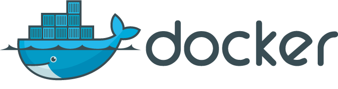
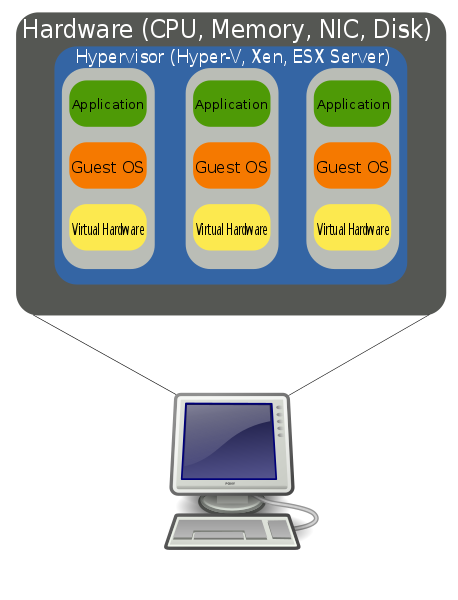

= Virtualizační technologie, cloud computing
:source-highlighter: coderay
:listing-caption: Listing
:pdf-page-size: A4
:icons: font

(C) Lukáš Kotek, link:https://creativecommons.org/licenses/by-sa/4.0/[CC-BY-SA 4.0]

<<<

== Co je to virtualizace?
=== Definice

[quote, 'http://www.fi.muni.cz/~kas/pv090/referaty/2014-podzim/virt.html[Zdroj: muni.cz]']
____
Virtualizace je technologie umožnující provozovat více nezávislých virtuálních strojů na jednom fyzickém stroji. Potřeba virtuálních strojů vznikla jako odpověď na problematiku vývoje a debuggingu OS, která je v případě fyzického stroje obtížně řešitelná.
____

[quote, 'http://www.intertech.cz/virtualizace/[Zdroj: intertech.cz]']
____
Pokud bychom chtěli definovat virtualizaci jako takovou, můžeme říct, že se jedná o oddělení zdrojů (CPU, operační paměť) od fyzických komponent. Tato abstrakce je základní myšlenkou virtualizace a konsolidace architektury ať už serverové nebo desktopové.
____

=== Důvody pro nasazení virtualizace a její přínos

IMPORTANT: Závisí vždy na konkrétním druhu virtualizace. Ne každý umožňuje vše dále zmíněné.

* Testování od systému izolovaných aplikací
* Možnost dosažení vyššího zabezpečení 
* Lze emulovat různý hardware
+
NOTE: Možno i na hardware zcela jiné konfigurace
+

* Možnost uložit stav virtualizovaného systému
+
NOTE: Změny tedy nejsou nevratné -> opět vhodné pro testování
+

* Provoz více operačních systémů na jednom hardware
* Možnost provozovat více virtualizovaných operačních systémů na jednom fyzickém serveru
* Maximální využití hardware serveru
+
NOTE: Umožňuje přiřazení systémových prostředků konkrétním virtuálním strojům
+

* Server hosting (poskytnutí VPS -> **V**irtual **P**rivate **S**erver)
* Snadný přenos virtualizovaného OS na jiný hostitelský hardware (počítač) 
* Aplikace v Cloud computingu

=== Limitace a nároky

.Limitace:
* Řízení sítě (routery, routování)
* Problém s virtualizací speciálních zařízení (čtečky, bezdrátové karty apod.)

.Nároky:
* Velké množství operační paměni (souběžný provoz více operačních systémů)
* Často (u některých typů virtualizace) velké nároky množství a výkon procesorů

=== Základní pojmy

Hostitelský OS (hostovský, host):: OS, na kterém je spuštěn jeden nebo více virtualializovaných OS. Je odvislý od použitého hardware.

Virtualizovaný OS (virtuální, guest):: OS, který je spuštěn v prostředí virtuálního stroje (software) na hostitelském OS. Hardware může být plně, nebo částečně, emulován

Virtuální stroj (virtual machine):: "Schránka" vytvořená virtualizačním nástrojem, které přiřazujeme konkrétní parametry (velikost operační paměti, počet procesorových jader, režim práce síťové karty), která se vůči virtualizovanému OS tváří jako skutečný hardware.

Virtuální pevný disk:: Soubor obsahující data konkrétního diskového oddílu zpřístupněná virtuálním strojem (např. s příponou VDI u VirtualBoxu) virtualizovanému operačnímu systému.

== Rozdělení virtualizace
=== Kontejnerová virtualizace

* Více oddělených prostředí (tzv. kontejnerů) v rámci jednoho operačního systému

TIP: Do kontejneru je možné umístit samotnou aplikaci, aplikaci s knihovnami a běhovými prostředími, nebo i s podstatnou částí operačního systému, který potřebuje ke své funkci. 

* Výkonově efektivní řešení
** Kontejner je umístěn přímo v hostitelském systému, hardware není nijak emulován.
*
* Vysoké zabezpečení
** Aplikace uvnitř kontejneru nemůže zasáhnout mimo něj, pokud to přímo neumožníme.

TIP: Obdobný princip se nazývá "sandbox". Jedná se o čím dál častější formu nasazování aplikací.

* Jednoduchost nasazení
** vše nezbytně potřebné pro svůj chod má aplikace v samotném kontejneru. Ten pak můžeme lehce distribuovat dále na cílový (hostitelský) operační systém, kde aplikace poběží.
 
* Závislost na operačním systému a jeho jádru (v klasickém pojetí)
** Kontejner určený pro GNU/Linux poběží opět pouze na GNU/Linuxu.

NOTE: Mezi typické příklady patří například BSD Jail, chroot (využívá změny kořenového adresáře na unixových systémech), nebo Solaris Zones. Velice progresivním nástrojem pro práci s kontejnery dnes je *Docker*.

=== Softwarová virtualizace (emulace)

* *Hardware může být plně emulován*
* *Vysoké nároky na hardware*, na kterém je provozován hostitelský operační systém

TIP: Jedná se až o násobně vyšší nároky na hardware (oproti nativnímu stavu). Může být např. softwarově emulována každá jednotlivá instrukce z instrukční sady emulovaného mikroprocesoru.

* Možnost *emulovat různé procesorové architektury* 

TIP: ARMový CPU tak může být emulován v prostředí systému MS Windows zkompilovaného pro x86 instrukční sadu. 

NOTE: Příklady:  Android mobile device emulator (v rámci Android SDK od Google), DOSBox, QEMU, Xbox emulator

=== Paravirtualizace (částečná virtualizace)

* Nepřímý (zprostředkovaný) přístup k hardware
* Nelze používat hardwarovou akceleraci
* Závislost na konkrétní procesorové architektuře

NOTE: Virtualizovaný GNU/Linux zkompilovaný pro x86 poběží na MS Windows zkompilovaných pro x86. Pokud by GNU/Linux byl zkompilovaný pro ARM, není možné využít paravirtualizace.

* Nižší hardwarová náročnost než u emulace

NOTE: Příklady: VirtualBox, Virtual PC, VMWare

=== Plná virtualizace (s podporou hardware)

* Nutná podpora na straně procesoru
** AMD -- technologie AMD-V
** Intel -- VT-x

* Nutné speciální jádro (resp. jeho doplněk, jaderný modul)
* Přímý přístup k HW prostředkům
* Vysoký výkon srovnatelný s během v nativním prostředí

NOTE: Příklady: KVM, Xen, Virtualbox, VMWare

WARNING: Další možné druhy virtualizace? Kam zařadit např. technologii OpenVZ?

== Stručně o cloud computingu

* *Infrastructure as a service* (**I**aa**S**)
** Práce s virtuálními stroji a úložišti
+
NOTE: Amazon EC2, Google Compute Engine
+

* *Platform as a service* (**P**aa**S**)
** Práce s připravenými frameworky, webservery
+
NOTE: Google App Engine, Windows Azure Cloud services
+

* *Software as a service* (**S**aa**S**)
** Práce s konkrétním poskytovaným software
+
NOTE: Salesforce, Google Apps, MS Office 365
+

WARNING: Jiná možná pojetí?

== Klíčové pojmy

vistualizace, virtuální stroj, virtualizovaný operační systém, guest, hostitelský operační systém, host, cloud, kontejnerová virtualizace, kontejner, emulace, paravirtualizace, plná virtualizace, pass, saas, iaas

== Použité zdroje

. http://cs.wikipedia.org/wiki/Chroot
. http://www.fi.muni.cz/~kas/pv090/referaty/2014-podzim/virt.html
. http://www.intertech.cz/virtualizace/
. http://cs.wikibooks.org/wiki/Virtualizace_v_Linuxu#Kontejnerov.C3.A1_virtualizace

== Kam dál?

.Populární nástroj pro práci s kontenerovou virtualizací:
* https://www.docker.com/

.A seriál o tom, jak ho zprovoznit na jedné linuxové distribuci:
* https://mojefedora.cz/zaciname-s-dockerem-na-fedore/

.A pro změnu video o tom, že kontejnery nejsou pouze o Dockeru :-)
* https://m.youtube.com/watch?list=PLub6xBWO8gV_Mr-UuxrHcfUbuGv5n_N5g&v=rTIjheXbwE8

---

- Přehled kapitol: [link:../README.html[html]] [link:../README.pdf[pdf]] [link:../README.md[asciidoc]]

